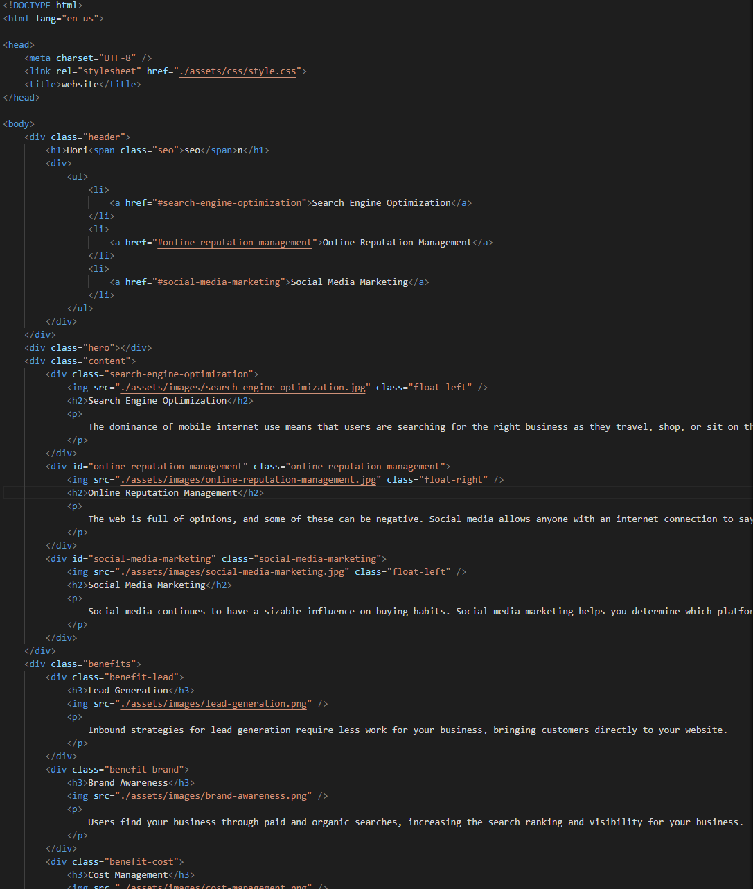

# html_css_git_refactor

# readme

## Updates css to meet accessibilties standards

[Link to deployed website:](https://trv893.github.io/html_css_git_refactor)

### website preview

### before

### after

